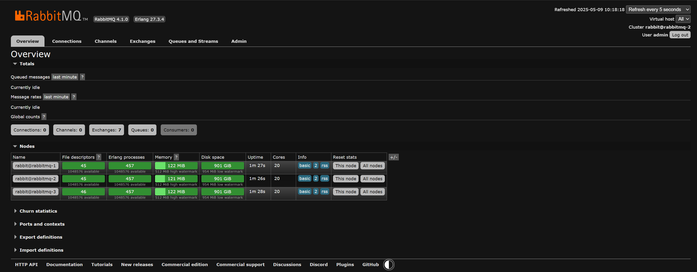

# RabbitMQ Deployment Guide

## Prerequisites

1. Initialize Docker Swarm (if not already initialized):
   ```sh
   docker swarm init
   ```

2. Create the `stream_net` overlay network:
   ```sh
   docker network create --driver=overlay --subnet=10.0.1.0/24 stream_net
   ```

## Configuration Steps

1. Update credentials in `rabbitmq-init-sample.sh`:
   - Replace the placeholder `username` and `password` values with your desired RabbitMQ credentials.

2. Rename the init script:
   ```sh
   mv rabbitmq-init-sample.sh rabbitmq-init.sh
   ```

3. Update the configuration file:
   - Open `rabbitmq.sample.conf` and enter the same `default_user` and `default_pass` values used in `rabbitmq-init.sh`.

4. Rename the configuration file:
   ```sh
   mv rabbitmq.sample.conf rabbitmq.conf
   ```

5. Create the RabbitMQ Docker config:
   ```sh
   docker config create rabbitmq-cnf ./rabbitmq.conf
   ```
6. Create the RabbitMQ Init Docker config:
   ```sh
   docker config create rabbitmq-init ./rabbitmq-init.sh
   ```

## Deployment

- Run the deployment process using the `Makefile` command

## Control Panel

- Using your browser go to `http://{your-node-ip-address}:15672`.
- Login using `username` and `password` values used in `rabbitmq-init.sh`


